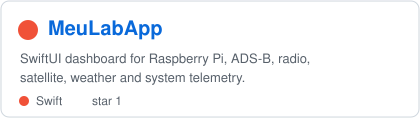
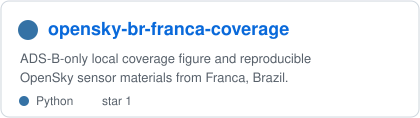
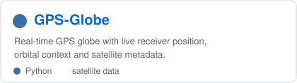
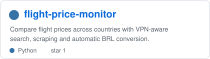

<pre align="center">
<strong>Eliel Felipe Junior |</strong> <a href="https://elielfelipe.com.br">Website</a> | <a href="https://meulab.fun">MeuLab</a> | <a href="https://github.com/eliel9012">GitHub</a> | <a href="https://www.linkedin.com/in/elielfelipe/">LinkedIn</a> | <a href="https://orcid.org/0000-0002-6333-1187">ORCID</a>
</pre>

  
  
  

I build small, practical systems that connect **local infrastructure, radio and aviation data, retro hardware and AI-assisted tooling**.

My projects usually start in a home lab: Raspberry Pi services, LAN discovery, ADS-B receivers, satellite/GPS visualizations, monitoring dashboards and tools that turn live data into something useful. I also enjoy bringing text, data and interfaces to older platforms such as Sega Genesis, Sega Saturn and DOS.

## Home Lab and Infrastructure

[MeuLab](https://meulab.fun) is the public face of my local lab: monitoring, telemetry and experiments running on small machines. Around it, I build tools for network visibility, service observability and everyday automation.

## Aviation, ADS-B and Satellites

I work with local aviation and satellite data, especially ADS-B coverage, GPS/GNSS context and live visualizations. The goal is reproducible, inspectable data pipelines that connect local receivers with maps, dashboards and research artifacts.

## Tools and Retro Computing

Some projects are practical utilities, like VPN-aware flight price monitoring. Others are experiments in constrained interfaces, like Bible readers and text systems for retro consoles and older environments.

## Current Focus

- Raspberry Pi infrastructure, monitoring and service automation
- ADS-B, GPS/GNSS and satellite data visualization
- SwiftUI dashboards for local telemetry
- Retrocomputing projects for Sega Genesis, Sega Saturn and DOS
- AI-assisted tools for research, dashboards and operations

## Metrics

  
  

  <a href="https://github.com/eliel9012">GitHub</a> |
  <a href="https://elielfelipe.com.br">elielfelipe.com.br</a> |
  <a href="https://meulab.fun">meulab.fun</a> |
  <a href="https://orcid.org/0000-0002-6333-1187">ORCID</a>

