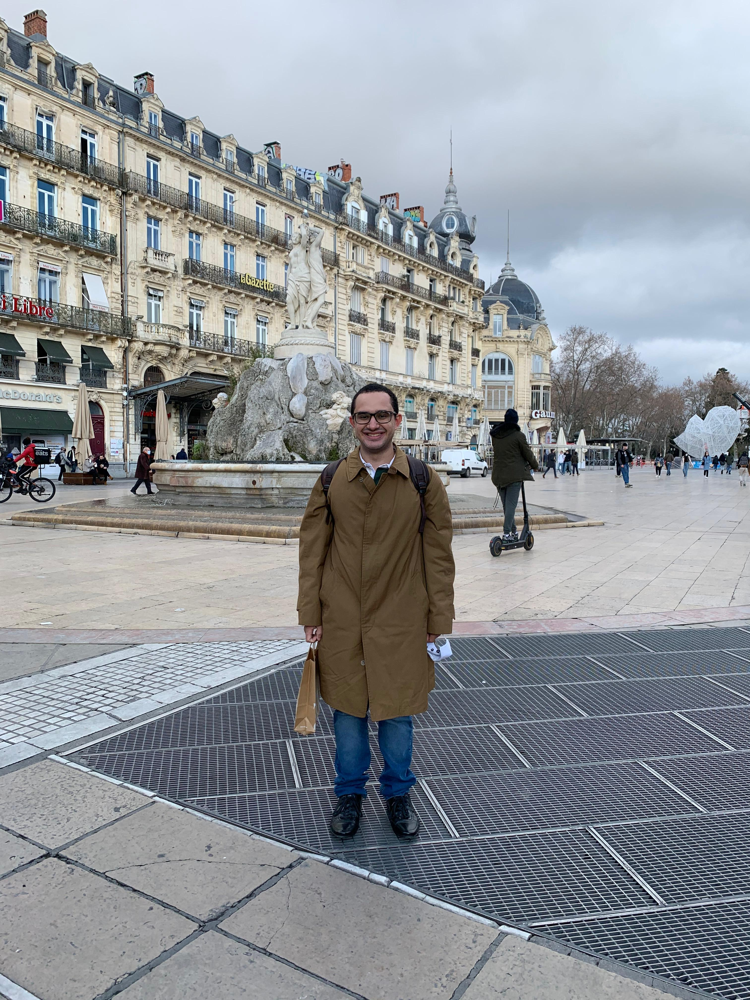

  

  <h1>Eliel Felipe Junior</h1>

  

    Developer interested in infrastructure, home automation, retro computing, aviation data and AI.
  

  

    <a href="https://elielfelipe.com.br">Website</a> |
    <a href="https://meulab.fun">MeuLab</a> |
    <a href="http://linkedin.com/in/elielfelipe/">LinkedIn</a> |
    <a href="https://orcid.org/0000-0002-6333-1187">ORCID</a>
  

  
  
  

I build practical systems that connect software with the physical world: Raspberry Pi services, LAN tools, ADS-B and satellite dashboards, iOS apps, retro console experiments and AI-assisted utilities.

My work usually sits close to infrastructure: small servers, local automation, monitoring, data collection and user-facing tools that make a home lab useful day to day.

## Featured Projects

  
  
  
  
  
  

## Current Focus

- Home lab services and observability at [MeuLab](https://meulab.fun)
- Raspberry Pi infrastructure, networking and automation
- ADS-B, GPS and satellite data visualization
- Retro computing projects for Sega Genesis, Sega Saturn and DOS
- AI tools that help with research, dashboards and local operations

## Metrics

  
  

  <a href="https://github.com/eliel9012">GitHub</a> |
  <a href="https://elielfelipe.com.br">elielfelipe.com.br</a> |
  <a href="https://meulab.fun">meulab.fun</a>

